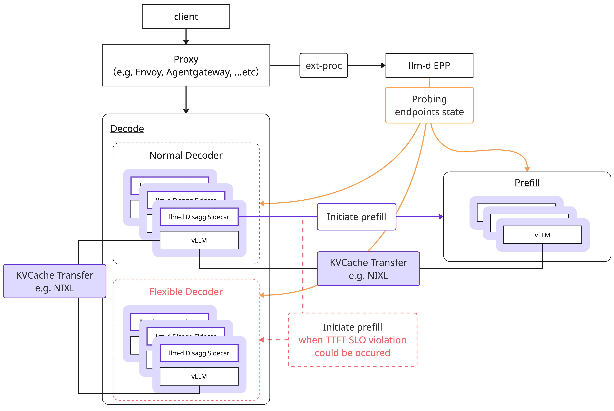

# POC: Flexible Decode

This directory contains the Proof of Concept (POC) implementation of **FlexibleDecode**, an SLO-aware dynamic routing mechanism for `llm-d-router`.

## Overview

FlexibleDecode introduces a new endpoint role (`flexible-decode`) and a set of EPP plugins that allow the router to **temporarily promote** decode workers to handle prefill tasks when the prefill pool is saturated.

This is particularly effective during burst traffic with long-context requests, where the prefill pool cannot keep up but the decode pool still has spare capacity. By dynamically utilizing low-load decoders as an "elastic buffer," FlexibleDecode helps prevent TTFT SLO violations while autoscaling catches up.

For detailed design and architecture, please refer to the [RFC](https://docs.google.com/document/d/1n7v8euAhacdAL2y7sjJqoVER5RYgDsFvoykRdrQfUl8/edit?usp=sharing).

## Architecture



To enable flexible decoding, you need to make the following changes:

- Modify the `llm-d-router` configuration to update relevant parameters and enable certain plugins
- Start a decode worker with the `flexible-decode` role

Changing the role of an existing decode worker to flexible-decode should work, but in that case, you need to pay attention to decode performance. For a detailed discussion, please refer to **Directly modify the decoder’s behavior** in the **Alternatives** section of the RFC.

## Getting started

### Deploy using helm

Helm chart is available. please refer to the  [`charts`](./charts/README.md) directory.

### Deploy manually

#### Step1. Build and deploy llm-d-router (llm-d-inference-scheduler)

Pre-build images (`amd64`) are available
| Image                     | URL                                                                                                                      |
|---------------------------|--------------------------------------------------------------------------------------------------------------------------|
| llm-d-inference-scheduler | `ghcr.io/aztecher/llm-d-inference-scheduler:poc@sha256:3e49c34d6fccf3985ecce63d9de17f7f36a60c3bb8f3dea957d598f10beb39be` |

Or, you can build container image from source.

```bash
# move to repistory root
cd ../../

# build image
make image-build
```

Please deploy llm-d-router to your k8s environment with additional configuration for new routing mechanism.

```yaml
plugins:
  ...
  - type: flexible-decode-filter
  - type: pool-view-producer
    parameters:
      pools:
        prefill:
          roles: [prefill, encode-prefill, prefill-decode, encode-prefill-decode]
        flex:
          roles: [flexible-decode]

  # Optional (This feature requires the latency prediction)
  - type: predicted-ttft-percentile-detector
    parameters:
      percentile: 0.99
      thresholdMs: 500

  # Optional
  - type: queue-depth-detector
    parameters:
      aggregation: percentile
      percentile: 0.99
      threshold: 40

  # Optional
  - type: kv-cache-pressure-detector
    parameters:
      aggregation: max
      threshold: 0.8

  # Optional
  - type: composite-saturation-detector
    parameters:
      strategy: max
      detectors:
      - pluginName: predicted-ttft-percentile-detector
      - pluginName: queue-depth-detector
      - pluginName: kv-cache-pressure-detector

  - type: slo-based-flexd-decider
    parameters:
      # Please set one of the new Saturation Detector plugin.
      #  - predicted-ttft-percentile-detector
      #  - queue-depth-detector
      #  - kv-cache-pressure-detector
      #  - composite-saturation-detector
      saturationDetectorPluginName: composite-saturation-detector
      saturationThreshold: 1.0
      pool: prefill
      selfDecode:
        policy: utilization-based
        parameters:
          kvCacheThreshold: 0.8
          queueDepthThreshold: 40

  - type: disagg-headers-handler
  - type: disagg-profile-handler
    parameters:
      profiles:
        decode: decode
        prefill: prefile
        # Require additonal parameter for flexible decode
        flexibleDecode: flexible-decode
      deciders:
        prefill: prefix-based-pd-decider
        # Require additonal parameter for flexible decode
        flexibleDecode: slo-based-flexd-decider

schedulingProfiles:
  - name: prefill
    plugins: [ ... existing prefill scoring ... ]
  - name: decode
    plugins: [ ... existing decode scoring ... ]
  # Add profiles for flexible decode
  - name: flexible-decode
    plugins:
    - pluginRef: flexible-decode-filter
    - ...

```

#### Step2. Add new role to flexible decode workers

Just like your existing decode workers, please launch workers for flexible decode.
But, be sure to label that workers `llm-d.ai/role: flexible-decode` instead of `llm-d.ai/role: decode`.

## Verification
Since flexible decode is a feature that is dynamically enabled when the prefill load is high, you need to reproduce this scenario.

There are several possible approaches:
- Reduce the number of prefill workers for PoC
- Apply a heavy prefill workload using benchmark tool
- Modify the plugin parameters so that it starts even under low load

Please select the method that best suits your environment.

We have also defined several metrics related to flexible decode. By collecting these metrics, you can visually verify the behavior of the flexible decoder.

| Metrics<br> (prefix: `llm_d_inference_scheduler_` ) | Type | Description |
|---------|------|-------------|
| flexible_decode_activation_total | Counter| Total count of Flexible Decode activations by `slo-based-flexd-decider` |
| flexible_decode_activation_evaluations_total | Counter | Total count of `slo-based-flexd-decider` evaluation |
| pool_saturation | Guage | Latest saturation value from the configured `SaturationDetector` for a pool |
| pool_saturation_threshold | Guage | Configured activation threshold for `slo-based-flexd-decider`, exposed as a gauge for dashboard overlay |


We provide a sample [Grafana dashboard](./grafana_dashboards/saturation-dashboard.json), so please use it as needed.

## Benchmark

Please refer to the [`benchmark/inference_perf`](./benchmark/inference_perf/README.md) directory.
